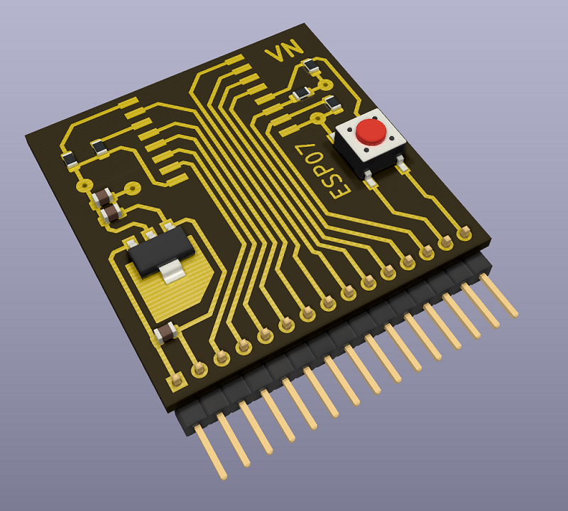
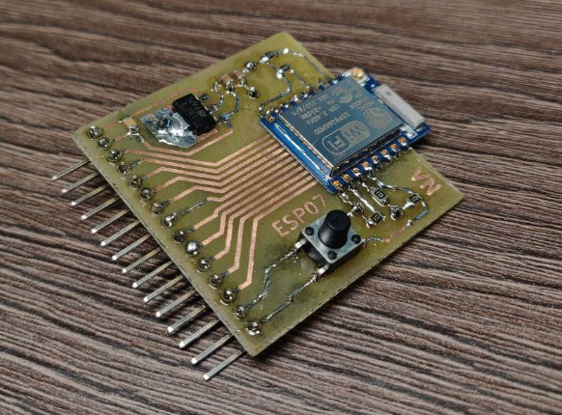

# esp07-breakout
Crude ESP-07 module breakout board intended for toner transfer method DIY PCB production.

Use [Mirrored_Front_Layer.svg](Mirrored_Front_Layer.svg) file for printing with 100% scale;  No additional mirroring required.
Also 2 additional *almost* parallel jumper wires should be placed on the backside of the PCB.

|Render               |Photo              |
|---------------------|-------------------|
|||